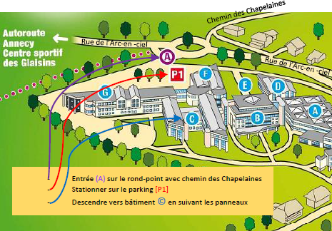

Accueil par le hall principal de l'IUT. 

Utiliser le parking P1 de l'IUT, près de l'arrêt de bus Charby, situé en contre-bas de l’arrêt de bus « CHARBY », ou du rond-point de la rue de l’Arc-en-ciel et du chemin des Chapelaines.

Rejoindre ensuite l’entrée principale de l’IUT en remontant le parking, puis en prenant à droite, puis à droite sur la large allée qui mène à cette entrée.

*INFORMATION* : La mise en place du plan VIGIPIRATE dans tous les bâtiments publics impose d’entrer dans l’IUT uniquement via son hall d’accueil (voir repère E sur le plan ci-dessous). Un fléchage pour rejoindre la salle C170 vous guidera depuis le hall d’accueil.

